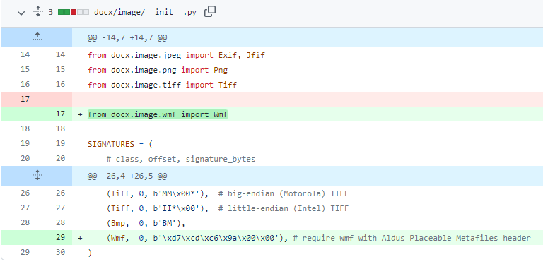
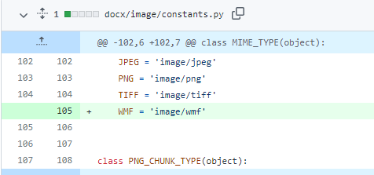

# 修改python-docx程序包文件使其支持wmf图像

感谢miguelfreitas大神的修改，参见https://github.com/python-openxml/python-docx/pull/731

python-docx版本0.8.11

1、修改python安装目录下的/Lib/site-packages/docx/image/\_\_init\_\_.py

17行增加

``from docx.image.wmf import Wmf``

29行增加

``(Wmf, 0, b'\xd7\xcd\xc6\x9a\x00\x00'),``

2、修改python安装目录下的/Lib/site-packages/docx/image/constants.py

105行增加

``WMF = 'image/wmf'``

3、python安装目录下的/Lib/site-packages/docx/image/下面新增[wmf.py](wmf.py)

4、删除python安装目录/Lib/site-packages/docx/image/下面的__pycache__文件夹
